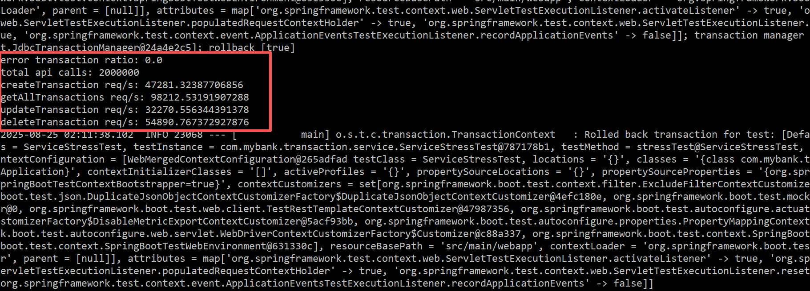

# Bank Transaction Management System

A bank transaction management system based on Spring Boot and Mybatis, which provides complete transaction CRUD operations, paginated queries, caching mechanisms, and support for containerized deployment.

## Tech Stack
- **JDK17/openjdk:17-jdk-slim**
- **Spring Boot 2.7.7**
- **MyBatis 2.1.4**
- **H2 memory database**
- **Caffeine cache**
- **Maven 3.6+**
- **Docker & Kubernetes**
- **curl**

## Deployment
  **I provide 2 ways to deploy this app.**

### Kubernetes deployment
1. **build the docker image from openjdk:17-jdk-slim**
```bash
docker build -t app-tom:1.0 .
```

2. **deploy to Kubernetes**
```bash
kubectl apply -f deployment.yaml
```

### Springboot jar deployment
**run the jar based on JDK17 in current project dir**
```bash
java -jar transaction-management-1.0.0.jar
```
**Attention: if you use this approach to run the app, all the ports used below should be changed from 30080 to 8080**

## User Interface
### http://localhost:30080/api/

## API brief operation guide
### 1. create transacion
```bash
curl -X POST 'http://localhost:30080/api/v1/mybank/transactions' -H "Content-Type: application/json" \
-d '{"accountNumber": "1111111111111111", "transactionType":"WITHDRAWAL", "amount":6777, "currency":"USD","description":"new desc","category":"FOOD"}'
```

### 2. update the transaction (you can get the id from the response of previous 'create transacion')
```bash
curl -X PUT 'http://localhost:30080/api/v1/mybank/transactions/{id}'  -H "Content-Type: application/json" \
-d '{"accountNumber": "2222222222222222", "transactionType":"WITHDRAWAL", "amount":7777, "currency":"USD","description":"update desc","category":"FOOD", "status":"UNCERTAIN"}'
```

### 3. Pagination query for list all transactions
```bash
curl -X GET 'http://localhost:30080/api/v1/mybank/transactions?page=1&size=20'
```

### 4. delete the transaction
```bash
curl -X DELETE 'http://localhost:30080/api/v1/mybank/transactions/{id}'

```
### API response data format
```json
{
  "success": true,
  "message": "success",
  "data": {
     "id": 572601420457443328,
     "xx": "xx"
  },
  "timestamp": "2024-01-01T12:00:00"
}
```
## API documents
http://localhost:30080/api/swagger-ui/index.html

## Test
### run unit test
**Note: if your local maven repository doesn't contain springboot, mybatis, h2, etc, you may have to wait a long time for them to finish downloading.**

```bash
mvn test -Dtest=TransactionServiceTest
mvn test -Dtest=TransactionDaoTest
mvn test -Dtest=ControllerTest
```

### run stress test
1. **run the mvn command**
```bash
mvn test -Dtest=ServiceStressTest
```
2. There is 4 apis: createTransaction, getAllTransactions, updateTransaction, deleteTransaction.  
 500 concurrency, 500,000 calls per API, The total number of calls is 2,000,000.  
 The test laptop has only 4 Intel cores and get the results as below:   
   

3. **NOTE:** Since the server and client are deployed on the same laptop, and we open 500 threads to mock concurrent requests, this service spent too much time on thread context switch. The root cause of the problem lies in the insufficient number of CPUs. 

4. **run the api stress test**
```bash
java -jar apitest-1.0.0.jar 30080  #or 8080
```
Client send http requests with 100 concurrency, 100,000 calls per API, The total number of calls is 400,000.  
ApiTest.java in package com.mybank.transaction.util;
## project structure
```
src/
├── main/
│   └── java/
│       └── com/
│           └── mybank/
│               └── transaction/
│                   ├── config/  # Cache config
│                   ├── controller/  # rest controller
│                   ├── dao/      # database operation 
│                   ├── domain/       # entity class
│                   ├── exception/   
│                   └── service/     # business logic
```

## Database design
### Transaction entity
```
| column | type|
|------|------|------|
| id | BIGINT | Primary key|
| account_number | VARCHAR(50) |
| transaction_type | VARCHAR(20) |
| amount | DECIMAL(15,2)
| currency | VARCHAR(3)
| description | VARCHAR(500) |
| category | VARCHAR(50) |
| status | VARCHAR(20) |
| created_at | TIMESTAMP|
| updated_at | TIMESTAMP |
```

### Transaction type
- DEPOSIT
- WITHDRAWAL
- TRANSFER
- PAYMENT
- REFUND
- FEE
- INTEREST

## cache strategy
- **query cache**: take Caffeine as local cache
- **cache expiration time**: 30 mins
- **max cache nums**: 100000
